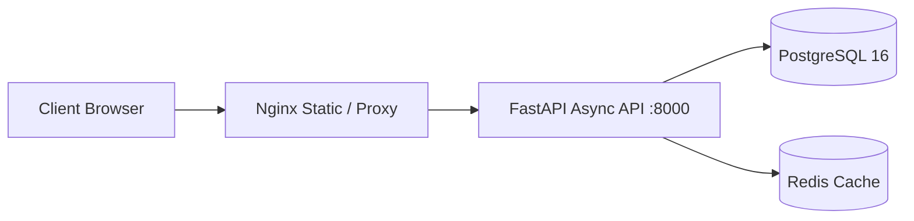

# fastapi-react-business-platform

> High-performance business platform combining Python 3.12 FastAPI backend, Pydantic v2 schemas, PostgreSQL, and React TypeScript frontend.

## Architecture Overview

## Features
- Python 3.12 FastAPI with async/await handlers
- Automatic interactive documentation (Swagger UI & Redoc)
- Pydantic v2 data validation and response models
- React 18 frontend with TypeScript and Tailwind CSS
- Multi-stage Docker packaging running as unprivileged user
- Unit and integration tests with pytest and HTTPX

## Author
**Manish Lalotra**  
Full Stack Developer & DevOps Engineer  
*Full Stack Developer | DevOps Engineer | Cloud & Infrastructure Engineer*

## License
MIT License. See [LICENSE](LICENSE) for details.
